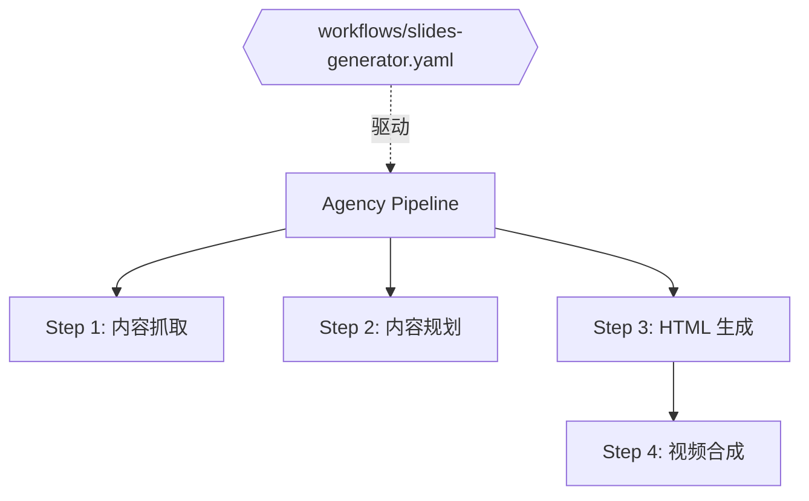

# Slides Generator

> 输入 URL 或文本 → AI 自动生成 12 种风格的 HTML 幻灯片 + 4K 高清视频

基于 Next.js 15 + TypeScript 构建的 AI 幻灯片生成器。系统通过 **多步 Claude Code CLI 流水线** 自动从内容抓取到大纲规划，最终生成具备电影感动画的 HTML 幻灯片和同步视频。

## 功能特性

- **12 种内置风格**：从霓虹赛博朋克到牛皮纸质感，每种风格有独立的配色、字体和视觉调性。
- **高保真视频生成**：集成 Remotion 引擎，通过 **HDMI-Sync (HTML-Native Synchronization)** 技术，将 HTML 动画 1:1 录制为 MP4 视频。
- **双比例支持**：支持横屏 16:9（Youtube）和竖屏 9:16（抖音/小红书）。
- **四步 Skill Pipeline**：全流程自动化，支持内容抓取、规划、HTML 生成及视频合成。
- **实时进度推送**：通过 SSE 实时展示流水线每一步的状态。

## 核心架构：声明式工作流驱动 (Agency Workflow)

本项目的核心流水线由声明式的 YAML 配置文件驱动，实现了逻辑与执行的分离：

- **工作流定义**：所有生成逻辑定义在 `workflows/slides-generator.yaml` 中。
- **角色化执行**：每个步骤（Step）都映射到一个特定的 AI 角色（如 `agent-browser`, `frontend-slides`），并携带独立的上下文和 Skill。
- **混合编排**：前三步内容创作由 YAML 工作流驱动，最后一步视频合成由 `remotion-runner` 逻辑驱动。



## 底层驱动：Agency 调度架构深度解析

本项目的流水线系统是一套基于 **Agency Orchestration** 思想的智能调度系统。其运作机制分为四个关键层级：

#### 1. 声明式 DSL 层 (YAML)
通过 `workflows/slides-generator.yaml` 定义整个生成命脉。它规定了：
- **DAG 依赖图**：自动分析 `depends_on` 依赖关系，构建执行拓扑图，确保数据流向有序。
- **变量插值引擎**：自动识别 `{{source}}` 或 `{{slide_outline}}` 等占位符，并实时从运行上下文中注入数据。

#### 2. 编排调度引擎 (Agency Orchestrator)
基于 `agency-orchestrator` 核心库，负责将静态的 YAML 转换为动态的执行流：
- **状态管理**：监控每个步骤的生命周期（Pending -> Running -> Done/Failed），并处理异常重试。
- **并发控制**：根据核心配置决定任务的并行执行策略，最大化资源利用率。

#### 3. 智能连接器 (Claude Code CLI Connector)
这是系统的执行神经。它将抽象的 `task` 转化为具体的 CLI 指令：
- **Role-to-Skill 映射**：根据 YAML 中的 `role`，连接器会启动 `claude --print` 并自动挂载对应的 `.agents/skills/` 语境。
- **捕获与通信**：通过 Stdio 与 Claude Code 交互，实现“意图下达”与“代码/内容捕获”。

#### 4. 混合执行后端
系统兼具 LLM 智能生成与高效率脚本执行：
- **原子任务**：对于确定性极强的任务（如 URL 内容提取），Orchestrator 直接调用本地脚本加速。
- **创造性任务**：对于规划、HTML 设计等任务，则驱动 LLM 代理进行多步推理与生成。

## 技术栈

| 层 | 技术 |
|---|------|
| **框架** | Next.js 15.1.0 (App Router), React 19 |
| **AI 执行** | Claude Code CLI (`claude --print`) |
| **视频引擎** | [Remotion](https://www.remotion.dev/) (React-based Video SDK) |
| **自动化/渲染** | Puppeteer (Headless Browser), FFmpeg |
| **实时通信** | Server-Sent Events (SSE) |

## 项目结构

```
slides-generator/
├── .claude/skills/               # Claude Code CLI 技能集
├── workflows/                    # 自动化工作流定义 (YAML)
├── app/                          # Next.js 页面与路由
├── remotion/                     # Remotion 视频模板与任务工作目录
├── lib/
│   ├── pipeline/                 # ⭐ 编排核心
│   │   ├── orchestrator.ts       #     流水线中控 (替代旧的 index.ts)
│   │   ├── remotion-runner.ts    #     HTML-to-Video 渲染驱动 (HDMI-Sync)
│   │   └── run-workflow.ts       #     Claude Code 调用封装
│   └── style-presets.ts          # 12 种设计风格定义
├── public/output/                # 最终生成的资源 (HTML/MP4/SRT)
└── docs/                         # 设计规范与技术文档
```

## 渲染黑科技：HDMI-Sync

为了让视频完美复刻 HTML 的样式和复杂动画，我们采用了 **HDMI-Sync** 同步技术：
- **Bridge Script**: 在 HTML 中注入同步脚本，监听 Remotion 每一帧的进度。
- **Frame Lock**: 使用 `delayRender` 锁定 Remotion 截帧，直到 Iframe 内容加载完成。
- **Seek Sync**: 通过 `postMessage` 强行控制网页 CSS 动画的 `animation-delay`，实现毫秒级帧对齐。

## 使用流程

1. **选择风格**：在首页 12 种预设中选择，支持移动端/桌面端比例切换。
2. **输入内容**：提供文章 URL 或直接粘贴长文本。
3. **监控进度**：在任务面板查看 Web 抓取、大纲规划、HTML 生成和视频渲染的实时进度。
4. **获取成果**：完成后可在线预览 HTML 幻灯片，或直接下载带字幕的高清视频。

## 环境要求

- **Node.js** ≥ 20
- **FFmpeg** 必备（用于视频合成与字幕压制）
- **Claude Code CLI** 已安装并配置到环境变量。

## 待办事项

- [x] Remotion 视频生成集成 (HDMI-Sync)
- [ ] 导出为 PPTX 格式支持
- [ ] 用户确认大纲后的交互式生成
- [ ] 生产环境 Redis/DB 持久化
